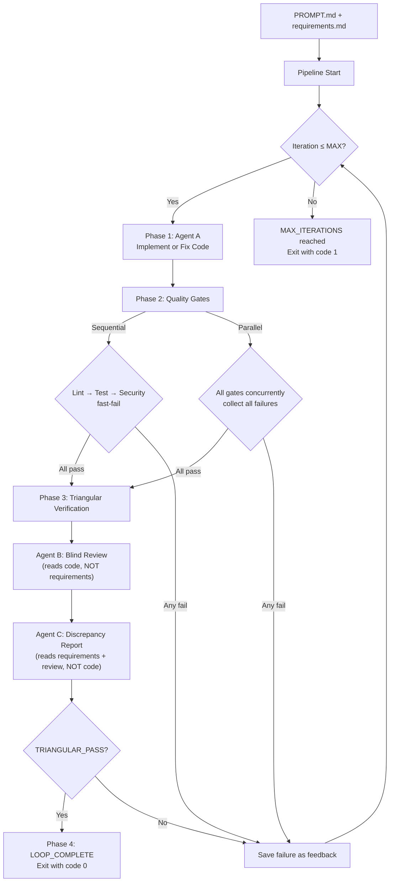
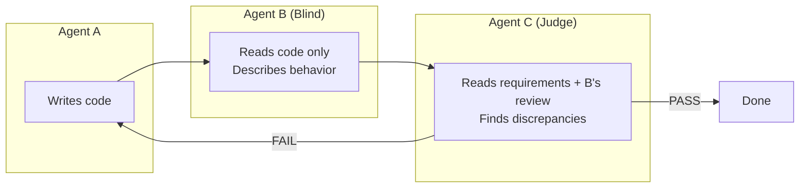

# agentic-dev-pipeline

A Claude Code skill that autonomously implements features through an automated loop: **code → quality gates → triangular verification → self-correction**, with zero human intervention.

**Project-agnostic** — auto-detects lint, test, and security tools for Python, Node, Rust, Go, and custom setups.

Use it as a **Python library** (dev dependency) or as a **standalone CLI tool** (`uv tool install`).

---

## Installation

### Python project — dev dependency

```bash
# uv (recommended)
uv add --dev agentic-dev-pipeline

# pip
pip install agentic-dev-pipeline
```

### Non-Python project (Node, Rust, Go, etc.) — CLI tool

```bash
# uv tool (recommended)
uv tool install agentic-dev-pipeline

# pipx
pipx install agentic-dev-pipeline
```

### From source (development)

```bash
git clone https://github.com/ella-yschoi/agentic-dev-pipeline.git
cd agentic-dev-pipeline
uv sync
```

---

## Quick Start

### 1. Initialize config files

```bash
agentic-dev-pipeline init
```

This creates:
- `PROMPT.md` — prompt template for Claude
- `requirements.md` — requirements template
- Config entry in `pyproject.toml` (if present) or `.agentic-dev-pipeline.toml`
- `.gitignore` entry for `.agentic-dev-pipeline/`

### 2. Edit templates

Fill in `PROMPT.md` and `requirements.md` for your feature. See `examples/` for filled-in examples.

### 3. Run

```bash
# Zero-flag — reads config from pyproject.toml or .agentic-dev-pipeline.toml
agentic-dev-pipeline run
```

Or from Python:

```python
from agentic_dev_pipeline import Pipeline

Pipeline().run()  # reads config from pyproject.toml or .agentic-dev-pipeline.toml
```

---

## Configuration

Settings are resolved in this priority order (highest wins):

**Python API args > `pyproject.toml` > `.agentic-dev-pipeline.toml` > Environment variables > Defaults**

### Option A: `pyproject.toml` (Python projects)

```toml
[tool.agentic-dev-pipeline]
prompt-file = "PROMPT.md"
requirements-file = "requirements.md"
max-iterations = 5       # default: 5
# timeout = 300          # per claude call, seconds
# base-branch = "main"
```

### Option B: `.agentic-dev-pipeline.toml` (Non-Python projects)

```toml
prompt-file = "PROMPT.md"
requirements-file = "requirements.md"
max-iterations = 3
```

### Option C: Environment variables

| Variable | Config field | Default |
|----------|-------------|---------|
| `PROMPT_FILE` | `prompt-file` | — |
| `REQUIREMENTS_FILE` | `requirements-file` | — |
| `MAX_ITERATIONS` | `max-iterations` | `5` |
| `CLAUDE_TIMEOUT` | `timeout` | `300` |
| `MAX_RETRIES` | `max-retries` | `2` |
| `BASE_BRANCH` | `base-branch` | `main` |

### Config fields

| Field | Type | Default | Description |
|-------|------|---------|-------------|
| `prompt-file` | string | — | Path to the prompt file |
| `requirements-file` | string | — | Path to the requirements doc |
| `max-iterations` | int | `5` | Maximum loop iterations |
| `timeout` | int | `300` | Timeout per claude call (seconds) |
| `max-retries` | int | `2` | Max retries per claude call |
| `base-branch` | string | `main` | Git diff base branch |

---

## Python API

### Minimal

```python
from agentic_dev_pipeline import Pipeline

converged = Pipeline(
    prompt_file="PROMPT.md",
    requirements_file="requirements.md",
).run()
```

### Zero-flag (config file)

```python
from agentic_dev_pipeline import Pipeline

# Reads prompt-file and requirements-file from pyproject.toml or .agentic-dev-pipeline.toml
Pipeline().run()
```

### Custom quality gate

```python
from agentic_dev_pipeline import Pipeline

def no_todos() -> tuple[bool, str]:
    """Fail if any TODO comments remain in source code."""
    import subprocess
    result = subprocess.run(["grep", "-r", "TODO", "src/"], capture_output=True, text=True)
    if result.returncode == 0:
        return False, f"Found TODOs:\n{result.stdout}"
    return True, "No TODOs found"

Pipeline(
    prompt_file="PROMPT.md",
    requirements_file="requirements.md",
).add_gate("no-todos", no_todos).run()
```

### Override config

```python
Pipeline(
    prompt_file="PROMPT.md",
    requirements_file="requirements.md",
    max_iterations=3,
    timeout=600,
    base_branch="develop",
).run()
```

### Triangular verification only

```python
Pipeline(requirements_file="requirements.md").verify()
```

### Project detection only

```python
config = Pipeline().detect()
print(config.project_type)  # "python", "node", "rust", "go", or "unknown"
print(config.lint_cmd)      # detected lint command
```

### `Pipeline` reference

| Method | Returns | Description |
|--------|---------|-------------|
| `Pipeline(...)` | `Pipeline` | Create with optional config overrides |
| `.add_gate(name, func)` | `Pipeline` | Add a custom gate (chainable) |
| `.run()` | `bool` | Run full pipeline. `True` if converged |
| `.verify()` | `bool` | Run triangular verification only |
| `.detect()` | `ProjectConfig` | Run project auto-detection |
| `.config` | `PipelineConfig` | Access resolved config |

**Gate function signature**: `() -> tuple[bool, str]` — returns `(passed, message)`.

---

## CLI Commands

```bash
# Initialize config files in current project
agentic-dev-pipeline init
agentic-dev-pipeline init --force   # overwrite existing files

# Run the full pipeline
agentic-dev-pipeline run
agentic-dev-pipeline run --prompt PROMPT.md --requirements requirements.md
agentic-dev-pipeline run --max-iterations 3 --timeout 600

# Run with all options
agentic-dev-pipeline run \
  --prompt PROMPT.md \
  --requirements requirements.md \
  --max-iterations 3 \
  --timeout 600 \
  --parallel-gates \
  --plugin-dir ./custom-gates/ \
  --webhook-url "https://hooks.slack.com/..."

# Triangular verification only
agentic-dev-pipeline verify --requirements requirements.md

# Print detected project config
agentic-dev-pipeline detect

# Version
agentic-dev-pipeline --version
```

### CLI-only options

These options are only available via CLI flags or environment variables (not in config files):

| Flag / Env var | Default | Description |
|----------------|---------|-------------|
| `--output-dir` / `OUTPUT_DIR` | `.agentic-dev-pipeline/` | Artifact output directory |
| `--webhook-url` / `WEBHOOK_URL` | — | Webhook for notifications |
| `--parallel-gates` / `PARALLEL_GATES` | `false` | Run gates in parallel |
| `--plugin-dir` / `PLUGIN_DIR` | — | Custom gate plugin directory |
| `LOG_FORMAT` | `text` | `text` or `json` |
| `DEBUG` | — | Enable debug output |

### Detection override env vars

Override auto-detected values per project:

| Variable | Description |
|----------|-------------|
| `PROJECT_TYPE` | Force project type: `python`, `node`, `rust`, `go` |
| `LINT_CMD` | Lint command |
| `TEST_CMD` | Test command |
| `SECURITY_CMD` | Security scan command (empty = skip) |
| `SRC_DIRS` | Source directories (space-separated) |
| `INSTRUCTION_FILES` | Instruction files for Agent B (space-separated) |
| `DESIGN_DOCS` | Design doc paths for Agent B (space-separated) |
| `CHANGED_FILES` | Changed file list for verification (space-separated) |

---

## Pipeline Architecture



### Triangular Verification

Three independent agent perspectives eliminate blind spots that single-agent review misses:



---

## Supported Project Types

| Type | Detected by | Lint | Test | Security |
|------|------------|------|------|----------|
| Python | `pyproject.toml` / `setup.py` / `setup.cfg` | ruff / flake8 / pylint | pytest / unittest | semgrep / bandit |
| Node | `package.json` | eslint / npm lint | jest / vitest / npm test | semgrep / npm audit |
| Rust | `Cargo.toml` | cargo clippy | cargo test | semgrep / cargo-audit |
| Go | `go.mod` | golangci-lint / go vet | go test | semgrep / gosec |
| Custom | env vars | `LINT_CMD` | `TEST_CMD` | `SECURITY_CMD` |

Detection priority: **ENV var → Makefile target → package.json script → tool existence**

Python runner detection: `uv.lock` → `uv run`, `poetry.lock` → `poetry run`, otherwise bare. Tools are resolved from PATH first, then from the active venv (`sys.prefix`).

---

## Output Files

After completion, check `.agentic-dev-pipeline/`:

| File | Content |
|------|---------|
| `loop-execution.log` | Full execution log |
| `metrics.json` | Timing, iterations, gate results (JSON) |
| `blind-review.md` | Agent B's blind code review |
| `discrepancy-report.md` | Agent C's requirements vs code comparison |
| `feedback.txt` | Last iteration's feedback (deleted on success) |

---

## Claude Code Skill

Inside a Claude Code session, you can invoke this as a skill:

```
Use the agentic-dev-pipeline skill to implement <feature>.
PROMPT: path/to/PROMPT.md
Requirements: path/to/requirements.md
```

Claude Code automatically recognizes `~/.agents/skills/agentic-dev-pipeline/SKILL.md`.

---

## Examples

See the `examples/` directory for:

- **`PROMPT-example.md`** / **`requirements-example.md`** — Filled-in templates (User Auth API)
- **`python-project/`** — Python project using `pyproject.toml` config + custom gate
- **`node-project/`** — Node project using `.agentic-dev-pipeline.toml` + `uv tool install`

---

## Development

```bash
git clone https://github.com/ella-yschoi/agentic-dev-pipeline.git
cd agentic-dev-pipeline
uv sync

make test          # all tests
make test-unit     # unit only
make lint          # ruff check
make format        # ruff format
make check         # all checks
```

## Prerequisites

- Python 3.11+
- [uv](https://docs.astral.sh/uv/) (recommended) or pip
- [Claude Code](https://claude.ai/claude-code) CLI (`claude` in PATH)
- At least one quality tool for your project (lint, test, or security) — installed in PATH or active venv

## Troubleshooting

- **`claude` not found**: Check PATH with `which claude`
- **Wrong tools detected**: Override with `LINT_CMD`, `TEST_CMD`, `SECURITY_CMD`
- **Gate keeps failing**: Run `agentic-dev-pipeline detect` to check detected commands
- **TRIANGULAR_PASS not achieved**: Read `.agentic-dev-pipeline/discrepancy-report.md`; make requirements more precise
- **Timeout**: Increase with `--timeout 600` or `CLAUDE_TIMEOUT=600`

## Experiment Results

Experiment logs using this skill are available in the [renewal-review](https://github.com/ella-yschoi/renewal-review) project at `docs/logs/experiments-log.md`.

## License

MIT
