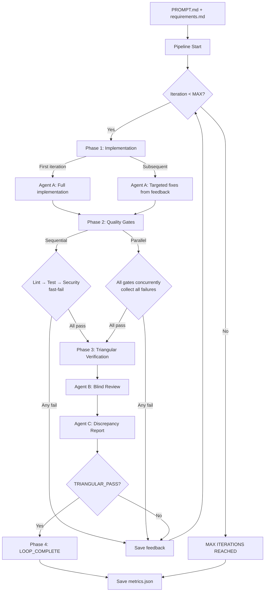
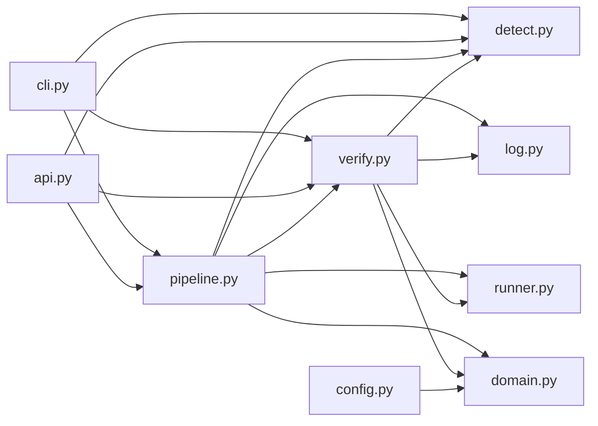
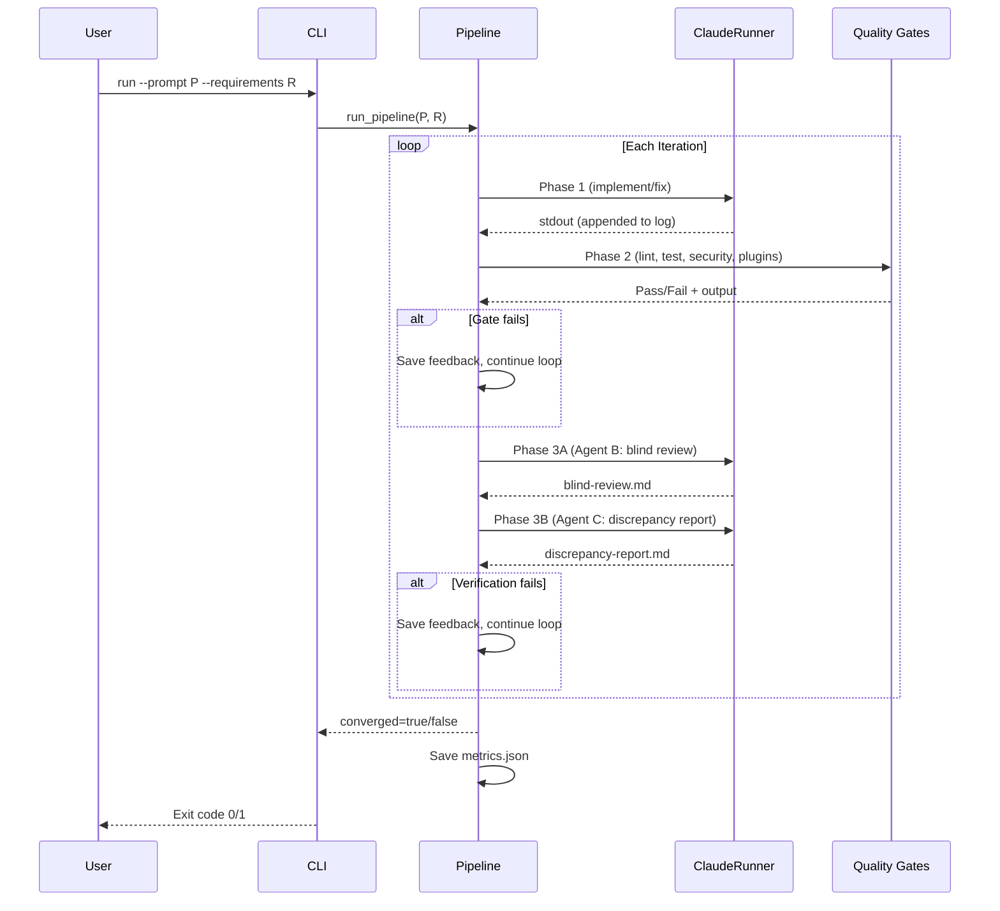

# Architecture

## Pipeline Flow



## Module Dependency



## File Structure

```
src/agentic_dev_pipeline/
├── __init__.py          # Version + public API exports
├── __main__.py          # python -m entry point
├── api.py               # Pipeline class (library API)
├── cli.py               # Argument parsing, subcommands (run/verify/detect/init)
├── config.py            # Hierarchical config loading (PipelineConfig)
├── detect.py            # Pure detection functions (no side effects)
├── domain.py            # Domain types: enums, value objects, metrics
├── init_cmd.py          # init command scaffolding
├── log.py               # Logger with text/JSON modes
├── pipeline.py          # Main loop: implement → gates → verify → correct
├── runner.py            # ClaudeRunner protocol + CLI implementation
└── verify.py            # Triangular verification: Agent B + C
```

## Data Flow



## Key Design Decisions

### Why Three Agents?
- **Agent A** implements code — it has full context but is biased toward its own work
- **Agent B** reviews code blindly — sees code but not requirements, so its description is unbiased
- **Agent C** compares — sees requirements and blind review but not code, detecting real gaps

This triangular approach catches bugs that single-agent review misses.

### Why Sequential AND Parallel Gates?
- **Sequential** (default): Fast-fail order. If lint fails, there's no point running tests on broken code. Each failure provides focused feedback for the next iteration.
- **Parallel** (`--parallel-gates`): Collects ALL failures at once. Useful when gates are independent and you want comprehensive feedback in a single iteration.

### Why ClaudeRunner Protocol?
`pipeline.py` and `verify.py` both call claude CLI. Instead of duplicating subprocess logic, a single `ClaudeRunner` protocol provides the abstraction. `CliClaudeRunner` is the default implementation; tests can inject a mock.

### Why Domain Types?
`domain.py` centralizes enums (`GateStatus`, `IterationOutcome`), value objects (`GateResult`), and metrics dataclasses. This eliminates magic strings scattered across pipeline.py and verify.py, and keeps backward-compatible `metrics.json` output via `to_dict()` methods.

### Why Subprocess for Claude?
The pipeline calls `claude --print -p "..."` via subprocess. This keeps the pipeline independent of Claude's internal API and works with any Claude Code installation.

### Eval Safety
Quality gate commands run via `subprocess.run(cmd, shell=True)` but are first checked against injection patterns (`$(...)`, backticks, `; rm`, etc.). Commands from env vars with unsafe patterns are blocked.
